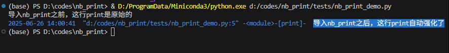

# nb_print

[](https://pypi.org/project/nb-print)
[](https://pypi.org/project/very-nb-print)
[](https://pypi.org/project/very-nb-print)

**`nb_print`：让你的 `print()` "活" 起来，一键跳转到代码位置。**

在大型项目或遗留代码中进行调试时，你是否曾被满屏的 `print` 输出所困扰，苦苦寻找 "这行输出究竟是哪里打印的？" `nb_print` 正是为解决这一痛点而生。

在调试项目和三方库时候，你也可以加print，替代断点debug。

它通过极简的方式，增强了 Python 内置的 `print` 函数，让你的每一次打印输出都附带源码位置的超链接。

---

## ✨ 核心功能

- **🚀 无感植入**: 只需在项目入口 `import nb_print` 一次，无需修改任何现有 `print` 代码，即可全局生效。
- **🖱️ 点击跳转**: 在 PyCharm, VSCode 等现代 IDE 的控制台中，点击输出前缀即可直接跳转到发起 `print` 的确切代码行。
- **🎨 智能美化**: 打印内容自动有色块和颜色。
- **🎯 解决痛点**: 彻底告别大海捞针式的 `print` 调试，极大提升开发和排错效率。
- **自带时间**： 自动添加是什么时间打印的

## 📦 pip安装

```bash
pip install very-nb-print
```

注意是安装 very-nb-print ，因为 nb_print 名字因为和其他包相似度高，不被pypi允许

## 🚀 使用方法

在你的项目主入口文件（例如 `main.py` 或 `app.py`）的顶部，加入一行导入语句即可。

```python
print('导入nb_print之前，这行print是原始的')

import nb_print

print('导入nb_print之后，这行print自动强化了')
```

**控制台打印是这样**
```shell
导入nb_print之前，这行print是原始的
2025-06-26 14:00:41  "d:/codes/nb_print/tests/nb_print_demo.py:5" -<module>-[print]-  导入nb_print之后，这行print自动强化了
```

**控制台图片效果**


## 🛠️ 工作原理

`nb_print` 的实现非常轻量，其核心原理是 **"猴子补丁" (Monkey Patching)**。

当 `import nb_print` 时，它会用一个自定义的函数替换掉 Python `builtins` 模块中的原生 `print` 函数。


## 🤝 贡献

欢迎通过提交 Issues 和 Pull Requests 来贡献代码、报告问题或提出功能建议。

## 📄 许可证

本项目基于 MIT License 开源。